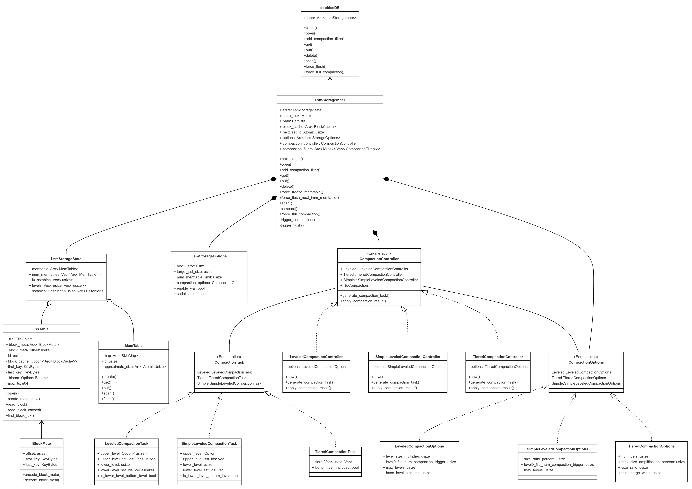

[](https://classroom.github.com/a/NJK_cPkH)

### 1. 프로젝트 소개
#### 1.1 배경 및 필요성

현대의 데이터 환경은 다양한 형태의 데이터를 대규모로 처리할 수 있는 능력을 요구하고 있습니다. 기존 관계형 데이터베이스는 일관된 테이블 구조와 스키마를 통해 강력한 데이터 무결성과 조회 성능을 제공하지만, 이질적이고 방대한 데이터를 처리하는 데 있어 중복 및 성능 문제가 발생할 수 있습니다. 또한, 데이터가 폭발적으로 증가함에 따라 높은 쓰기 성능이 필수적입니다.

이러한 요구에 부합하는 솔루션으로 NoSQL 데이터베이스가 주목받고 있습니다. NoSQL 데이터베이스는 유연한 스키마와 확장성, 고성능을 제공하여 현대적인 어플리케이션 구축에 필수적인 요소로 자리 잡았습니다. 예를 들어, Disney+와 Snapchat은 각각 1억 5천만 이상의 사용자에게 안정적인 대용량 서비스를 제공하기 위해 NoSQL 기반 시스템을 도입하여 성능 최적화와 지연 시간 감소를 달성하였습니다.

특히 NoSQL의 다양한 구조 중 LSM-TREE 기반의 키-값 저장소는 대용량 데이터 처리에 특화되어 있습니다. LSM-TREE는 쓰기 지연 방식을 통해 I/O 효율을 극대화하여, 대규모 데이터 삽입 시 효율적인 성능을 제공합니다. 이로 인해 LSM-TREE는 대용량 데이터 처리가 필요한 다양한 작업에서 폭넓게 활용되고 있습니다.

본 프로젝트는 이러한 LSM-TREE 기반 저장 시스템의 구현을 통해 대규모 데이터 쓰기 성능 최적화하는 것을 목표로 하고 있습니다.

#### 1.2 목표 및 주요 내용

이 프로젝트의 주요 목표는 LSM-TREE를 기반으로 대규모 데이터를 효율적으로 저장하고 관리할 수 있는 데이터베이스 저장 시스템을 구축하는 것입니다. 이를 통해 대용량 데이터의 쓰기 성능을 최적화하고, 다양한 컴팩션 방식에 대한 성능 평가와 개선을 수행합니다. 주요 내용은 다음과 같습니다:

1. LSM-TREE 기반 데이터베이스 저장 시스템 구현
LSM-TREE의 장점을 활용하여 대규모 데이터를 효율적으로 처리할 수 있는 데이터베이스 시스템을 구축합니다. LSM-TREE의 구조적 특성을 바탕으로 효율적인 쓰기 성능을 목표로 합니다.

2. 컴팩션 방식 구현 및 평가
기존 LSM-TREE에서 주로 사용되는 두 가지 컴팩션 방식인 Leveled Compaction과 Tiered Compaction을 구현합니다. 이를 통해 각 방식의 장단점을 평가하고, 이를 보완하기 위한 Simple Leveled Compaction 방식을 추가적으로 구현하여 성능을 비교합니다.

3. GUI 시스템 구축
사용자가 손쉽게 데이터를 입력하고 조회할 수 있도록 GUI 시스템을 개발하여 사용자 경험을 향상시킵니다. 직관적인 인터페이스를 통해 데이터의 쓰기 및 읽기 작업을 효율적으로 수행할 수 있습니다.

### 2. 상세설계

#### 2.1 데이터베이스 시스템 구성도



#### 2.2 사용 기술

##### 데이터베이스

##### 클라이언트

- React.js - React18
- tailwindcss

### 3. 설치 및 사용 방법

#### 데이터베이스

#### 클라이언트

1. npm install로 의존성 설치
2. npm install -D tailwindcss postcss autoprefixer로 tailwind 의존성 다운로드
3. npx tailwindcss init으로 tailwind 의존성 init
4. tailwind.config.js를 다음과 같이 작성

```javascript
/** @type {import('tailwindcss').Config} */
const colors = require('tailwindcss/colors')

module.exports = {
  content: ["./src/**/*.{jsx,js}"],
  theme: {
    extend: {
      colors: {
        'matisse': '#355F7D',
      },
    },
    extend: {},
  },
  plugins: [],
}
```

### 4. 소개 및 시연 영상

[](https://www.youtube.com/watch?v=Chjb8tGgkWw)

### 5. 팀 소개

<table>
  <tbody>
    <tr>
      <td align="center">
          <br />
          <sub><b>클라이언트 개발<br/>Kim Manjae<br/>@MilkTea24</b></sub>
        <br />
      </td>
      <td align="center">
          <br />
          <sub><b>FE 팀원 : 이름 1<br/>@FE_TeamMember1</b></sub>
        <br />
      </td>
      <td align="center">
          <br />
          <sub><b>FE 팀원 : 이름 2<br/>@FE_TeamMember2</b></sub>
        <br />
      </td>
    </tr>
  </tbody>
</table>

